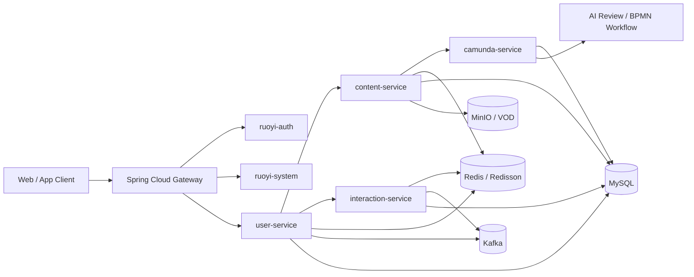
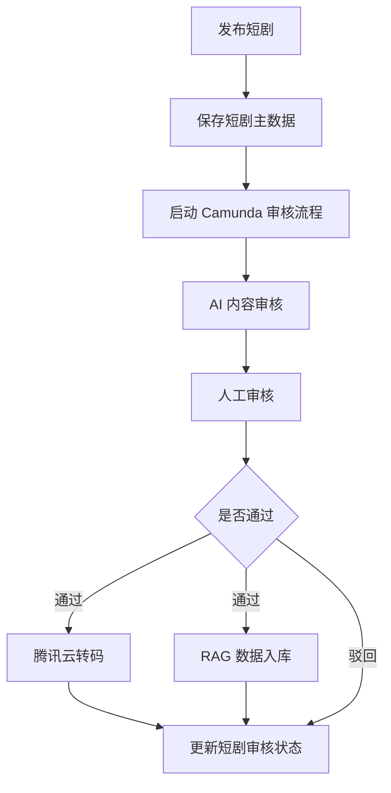

# 快看短剧内容平台

基于 `RuoYi-Cloud-Plus` 二次开发的短剧内容平台后端项目，围绕短剧内容生产、审核、分发与互动，拆分出独立的内容、用户、互动、流程服务，并结合 `Kafka`、`Redis/Redisson`、`OpenFeign`、`Camunda`、`Spring AI` 等能力构建完整业务闭环。

这个仓库更适合被当作一份“可讲述的面试项目”来阅读：既能看到标准微服务底座，也能看到围绕真实业务做出的聚合层、缓存层、异步链路与流程编排设计。

## 项目定位

- 项目类型：短剧内容平台后端微服务
- 技术基座：RuoYi Cloud Plus
- 核心方向：内容中台、App 聚合接口、互动解耦、审核工作流
- 适合展示的能力：系统设计、业务建模、分层架构、缓存设计、异步削峰、流程编排、工程化落地

## 项目亮点

1. 在标准 RuoYi 微服务底座上，扩展出短剧业务域的四个核心服务：`content-service`、`user-service`、`interaction-service`、`camunda-service`。
2. 将“后台内容管理”和“App 面向 C 端的聚合接口”分离，后台走标准 CRUD，App 侧走业务编排与缓存优先策略。
3. 点赞链路采用 `Kafka + Redis + 布隆过滤器` 解耦高频写请求，兼顾吞吐、幂等与前台查询体验。
4. 短剧发布接入 `Camunda BPMN` 流程，引入 AI 审核、人工审核、转码与 RAG 入库等节点，体现业务流编排能力。
5. 保留 `Nacos`、`Gateway`、`Auth`、`System`、`Redis`、`MinIO`、`Kafka`、`Docker Compose` 等基础设施，项目完整度高，便于从业务到平台一体化展示。

## 架构概览



## 核心模块职责

### 平台基础模块

| 模块 | 作用 |
| --- | --- |
| `ruoyi-gateway` | 系统统一入口，负责路由、鉴权前置、请求转发 |
| `ruoyi-auth` | 平台登录认证中心，基于 Sa-Token + Dubbo 实现账号体系能力 |
| `ruoyi-system` | 平台级用户、角色、菜单、租户、日志等基础能力 |
| `ruoyi-common` | 通用组件沉淀，包括 Web、MyBatis、Redis、日志、Nacos、Sentinel 等 |
| `ruoyi-api` | 跨服务 API 契约层，供 Dubbo 远程调用使用 |

### 短剧业务模块

| 模块 | 作用 | 关键技术 |
| --- | --- | --- |
| `content-service` | 短剧、剧集、演员、分类、标签等内容主数据管理；发布短剧并发起审核流程 | MyBatis-Plus、OpenFeign、MinIO、Spring AI、Redisson |
| `user-service` | 面向 App 的聚合层；负责首页精选、详情页、短信登录、用户信息与缓存编排 | OpenFeign、Sa-Token、Redis、Redisson、Kafka |
| `interaction-service` | 负责点赞等互动写链路，异步消费事件并维护持久化状态 | Kafka、Redis、Bloom Filter |
| `camunda-service` | 承载短剧审核 BPMN 流程，串联 AI 审核、人工审核、转码、RAG、状态回写 | Camunda、OpenFeign、Spring AI |

## 典型业务闭环

### 1. 首页精选与详情查询

`user-service` 对外提供 `/api` 聚合接口，优先查 Redis 缓存；若未命中，则调用 `content-service` 获取内容数据，再回填缓存并补充当前用户点赞状态。

这条链路体现了两个设计点：

- C 端接口与后台管理接口分离，避免让前端直接拼装多个后台接口。
- 使用缓存 + 布隆过滤器 + 自定义缓存切面，缓解缓存穿透、击穿与热点数据回源问题。

### 2. 用户点赞异步化

用户点赞请求由 `user-service` 接收后，不直接同步落库，而是投递到 Kafka。`interaction-service` 异步消费点赞事件，做幂等校验、写入数据库、修正缓存中的点赞数。

这条链路的价值在于：

- 把高频写操作和同步接口响应解耦。
- 用布隆过滤器降低重复消费风险。
- 用 Redis 快速判断“当前用户是否点赞过”，优先保证查询体验。

### 3. 短剧发布与审核流程

内容发布时，`content-service` 会在一个业务事务内完成短剧主表、分类、标签、演员、剧集等数据落库，然后调用 `camunda-service` 启动审核流程，并记录流程实例 ID。

审核流程本身并不是单点步骤，而是一个 BPMN 编排：



这条链路展示的是完整业务编排能力，而不只是“写几张表”。

## 技术栈

| 类别 | 技术 |
| --- | --- |
| 语言与框架 | Java 21、Spring Boot 3.4.7、Spring Cloud 2024.0.0 |
| 微服务基础设施 | Nacos、Spring Cloud Gateway、Dubbo、Sentinel |
| 认证与权限 | Sa-Token |
| 数据访问 | MyBatis-Plus、Dynamic Datasource、HikariCP |
| 缓存与分布式能力 | Redis、Redisson、Bloom Filter |
| 异步消息 | Kafka |
| 工作流 | Camunda BPMN |
| 文件与媒体 | MinIO、Tencent VOD |
| AI 集成 | Spring AI、Ollama、DashScope、DeepSeek/OpenAI 兼容接入 |
| 工程支持 | Maven、Docker Compose、SpringDoc、XXL-Job |

## 仓库结构

```text
kcat
├─ ruoyi-auth                    # 认证中心
├─ ruoyi-gateway                 # 网关入口
├─ ruoyi-common                  # 通用能力沉淀
├─ ruoyi-api                     # 跨服务契约
├─ ruoyi-modules
│  ├─ ruoyi-system              # 平台系统服务
│  ├─ content-service           # 内容主数据与发布审核入口
│  ├─ user-service              # App 聚合层与用户能力
│  ├─ interaction-service       # 点赞/互动异步处理
│  └─ camunda-service           # 审核工作流服务
├─ ruoyi-visual                  # 监控与中间件可视化模块
├─ ruoyi-example                 # 示例模块
└─ script
   ├─ config/nacos              # Nacos 配置
   └─ docker                    # Docker Compose 与中间件编排
```

## 本地运行

### 1. 基础环境

- JDK 21
- Maven 3.9+
- Docker / Docker Compose
- MySQL 8
- Nacos
- Redis
- Kafka
- MinIO

### 2. 启动基础设施

仓库已提供编排文件，可参考：

- `script/docker/docker-compose.yml`
- `script/config/nacos/`

推荐先启动本地基础设施，再导入 Nacos 配置，最后启动业务服务。

### 3. 构建项目

```bash
mvn clean package -DskipTests
```

### 4. 启动核心服务

建议至少启动以下服务观察完整链路：

- `ruoyi-gateway`
- `ruoyi-auth`
- `ruoyi-system`
- `content-service`
- `user-service`
- `interaction-service`
- `camunda-service`

其中业务服务入口类包括：

- `com.lfy.kcat.content.ContentServiceApplication`
- `com.lfy.kcat.UserServiceApplication`
- `com.lfy.kcat.InteractionServiceApplication`
- `com.lfy.kcat.workflow.CamundaApplication`

### 5. 关键端口

| 服务 | 端口 |
| --- | --- |
| `ruoyi-gateway` | `8080` |
| `content-service` | `10001` |
| `user-service` | `10002` |
| `interaction-service` | `10021` |
| `camunda-service` | `8088` |

## 我在这个项目里重点体现的工程能力

### 1. 业务拆分能力

不是把所有逻辑都堆在单体服务里，而是按照“内容主数据 / 用户聚合 / 互动异步 / 流程编排”进行职责拆分，让服务边界和数据边界更清晰。

### 2. 缓存设计能力

在 `user-service` 中把首页精选、剧集详情、短剧详情等高频读场景前置到 Redis，并引入布隆过滤器和缓存切面，体现出对热点数据和缓存风险点的理解。

### 3. 异步解耦能力

点赞链路没有采用同步写库，而是基于 Kafka 将请求接入层和状态落库层解耦，减少接口阻塞，提升系统弹性。

### 4. 工作流建模能力

把短剧审核抽象为 BPMN 流程，而不是把所有审核逻辑硬编码在一个 Service 方法里，使“AI 审核 + 人工审核 + 转码 + 状态回写”具备可编排、可扩展的特点。

### 5. 平台化复用能力

项目不是从零搭脚手架，而是在成熟微服务底座上进行二次开发，保留了网关、认证、租户、日志、监控、配置中心等平台能力，体现的是“在现有平台上扩展业务”的真实企业研发方式。


## 后续可优化方向

- 将业务服务的网关路由和容器化部署进一步补齐，形成完整的一键联调链路。
- 把当前本地开发配置中的敏感信息进一步外置，统一收敛到安全配置中心或环境变量中。
- 为关键业务链路补充更完整的集成测试与压测基线。
- 增加前后端联调截图、时序图和接口示例，让仓库展示效果更直观。

## 说明

- 本仓库重点展示后端微服务与业务实现，不包含完整前端工程。
- 底座能力来源于 `RuoYi-Cloud-Plus`，业务模块与实现方式为本项目的二次开发内容。
- 如果你是面试官，推荐优先阅读：`content-service`、`user-service`、`interaction-service`、`camunda-service` 这四个模块。
